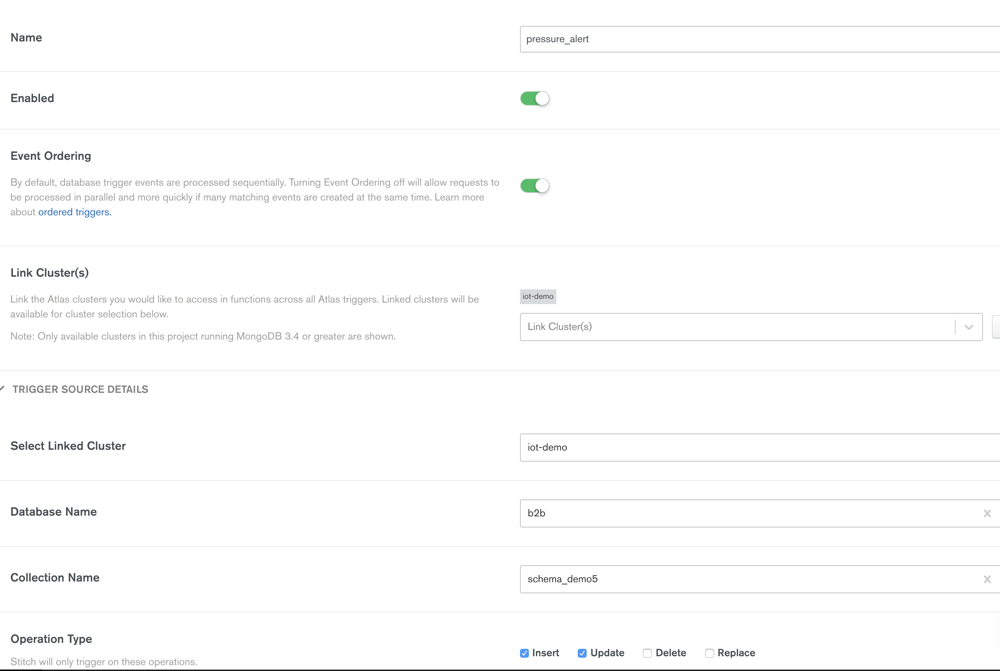

# arm-iot

## Queries

Find any bucket document with a measurement where pressure >= 1040

```javascript
db.schema_demo5.find({'measurements.pressure' : { '$gte' : 1040 }})
```

Find any bucket document with a measurement where pressure >= 1040 and filter the sub measurements to only include those readings

```javascript
db.schema_demo5.aggregate(
    [{$match: {
    "measurements.pressure" :
     { $gte : 1040 }
    }}, {$project: {
    elems : {
        $filter : 
        {
        input : "$measurements",
        as : 'item',
        cond : { $gte : ['$$item.pressure', 1040] }
        }
    },
    sensor_id : 1,
    count : 1
    }}]
)
```

## Reactive code

Use an Atlas Trigger to respond to a particular document update



Use a match expression like

```javascript
{ "fullDocument.measurements.pressure" : { "$gte" : 1050 } }
```

And a function like

```javascript
exports = function(changeEvent) {

  console.log(changeEvent);
  
  var collection = context.services.get("iot-demo").db("b2b").collection("alerts");
  var alert_message = { 'message' : 'Pressure has gone above value', 'm' : changeEvent.fullDocument };
  collection.insertOne(alert_message);
  
};
```
